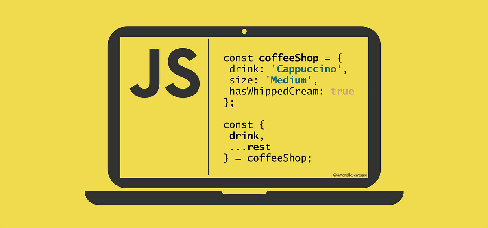

# JavaScript Mastery Repository 🚀

Welcome to the JavaScript Mastery repository! In this repository, I’ve compiled a comprehensive guide to JavaScript, covering everything from the basics to advanced concepts. Whether you’re a beginner or an experienced developer, you’ll find valuable content here.

## Table of Contents

- [Introduction](#introduction)
- [Getting Started](#getting-started)
- [Core Concepts](#core-concepts)
- [Real-World Examples](#real-world-examples)
- [Data Structures and Algorithms](#data-structures-and-algorithms)
- [Contributing](#contributing)
- [License](#license)

## Introduction

JavaScript is a versatile programming language that powers the web. From interactive websites to server-side applications, JavaScript plays a crucial role. In this guide, we’ll explore its various aspects, step by step.

## Getting Started

Before diving into the details, make sure you have the following prerequisites:

- Basic understanding of HTML and CSS
- A code editor (e.g., Visual Studio Code, Sublime Text, or any other of your choice)
- Node.js installed (for running JavaScript outside the browser)

## Core Concepts

1. **Variables and Data Types:** Learn how to declare variables, work with strings, numbers, booleans, and other data types.

2. **Control Flow:** Explore conditionals (if statements, switch cases), loops (for, while), and error handling (try-catch).

3. **Functions:** Master function declarations, arrow functions, and higher-order functions.

4. **Objects and Classes:** Understand object-oriented programming (OOP) in JavaScript.

5. **Asynchronous JavaScript:** Dive into promises, async/await, and handling asynchronous operations.

## Real-World Examples

In this section, I’ve provided practical examples of JavaScript usage. From building a simple to-do list app to creating interactive forms, you’ll find code snippets and explanations.

## Data Structures and Algorithms

Prepare for technical interviews! I’ve included common DSA questions along with solutions. Practice these to enhance your problem-solving skills.

## Contributing

Contributions are welcome! If you’ve discovered a bug, want to add more examples, or improve existing content, feel free to submit a pull request.

## License

This project is licensed under the MIT License. Feel free to use, modify, and share it.

Feel free to replace the placeholders with actual content, add images, and link to specific files within your repository. Happy coding! 🌟🔥
